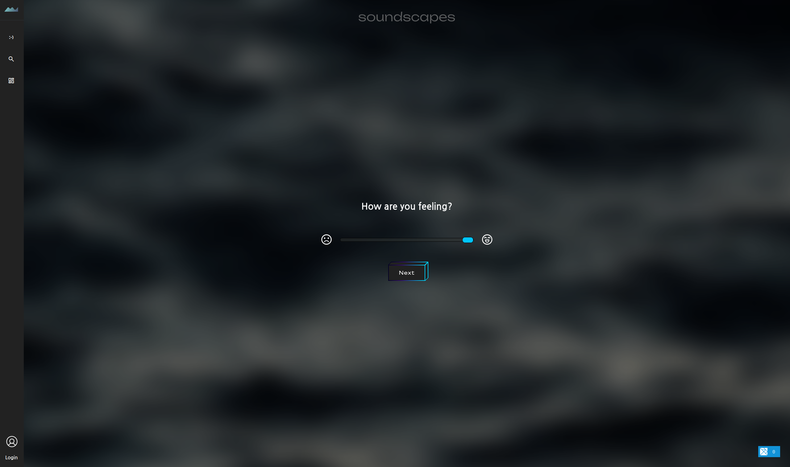
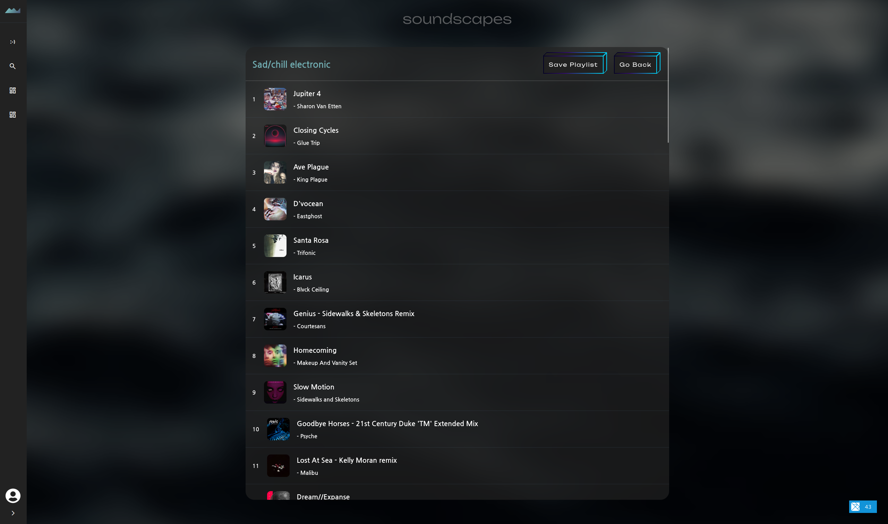

# Soundscapes

[](https://github.com/lindsaykwardell/vite-elm-template/actions/workflows/ci.yml)

Backend is here: [backend-soundscapes](https://github.com/ProgramingIsTheFuture/soundscapes-backend)
## Features

- [Hot Module Reload](https://github.com/hmsk/vite-plugin-elm) of all code in the app (including Elm)
- Tooling installation via [elm-tooling](https://elm-tooling.github.io/elm-tooling-cli/)
  - Includes Elm, elm-format, elm-json, and elm-test-rs
- Basic unit test and [elm-review](https://package.elm-lang.org/packages/jfmengels/elm-review/latest/) examples
- Github Actions CI for running tests

## Running
```
cd soundscapes
npm install
npm run dev
```

### Screenshots:  


